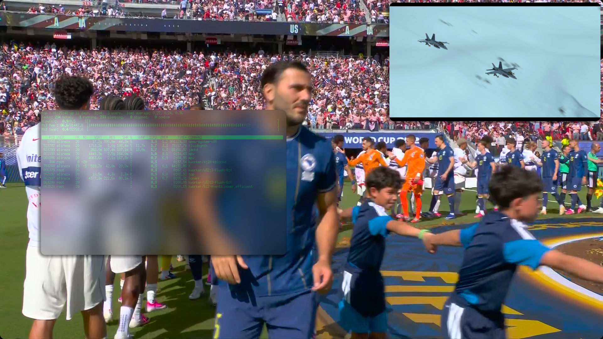
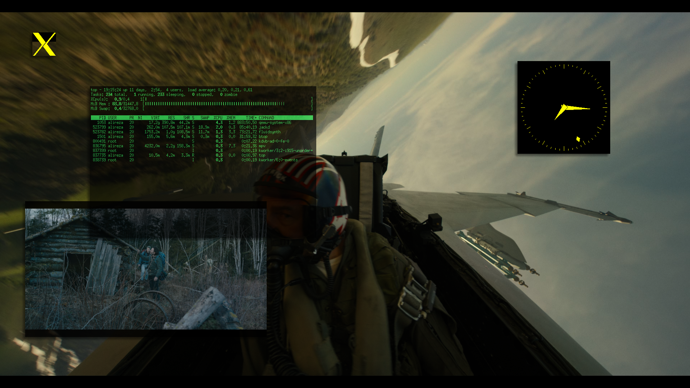
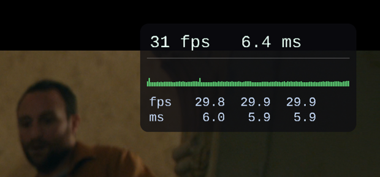

# ricom 🦀

A robust **X11 compositor written from scratch in Rust** — a clean reimplementation of
[picom](https://github.com/yshui/picom)'s core, built straight on `x11rb` + EGL. It redirects the
screen and composites every window onto the X overlay with **OpenGL/EGL** and zero-copy
texture-from-pixmap, tear-free at vsync — then goes well past the basics: a full **composable
animation engine** (windows spin, wobble, stretch, dissolve, slide, and dim), region-level
occlusion culling, and `use-damage` partial repaint so an idle screen costs next to nothing.


*Scripted through the `ricomctl` control socket: a fullscreen window boings in, the xclock dissolves
into embers, then ricom spins, stretches, pops, and wobbles two live video windows **in place** —
every step captioned by a self-drawn OSD toast. (15 s GIF loop above; the full-quality 1080p clip plays below.)*

https://github.com/user-attachments/assets/051b89cc-22a2-4cf1-8b9a-7aa63c9bef39

## Highlights

- **A real animation engine — not a fixed effect list.** Every window transition (open · close ·
  move) is a recipe over composable primitives — opacity, scale, translate, spring-wobble, GPU
  spin, noise-dissolve — chosen by a preset or hand-composed, applied globally or per-app, and
  live-reloaded from TOML on `SIGHUP`. Windows *boing* in, *spin* out, *stretch* open from a centre
  line, *dissolve* into embers, or slide off-screen — your call.
- **Wobbly windows.** The Compiz spring-mesh jelly: windows lag and jiggle as they settle after a
  move or resize, on a dedicated GL mesh path.
- **Nearly free when idle.** Damage-driven, with region-level occlusion culling and EGL
  buffer-age partial repaint — a static screen with one updating window repaints *just that window*.
  A lone fullscreen window trips *unredir*: ricom steps aside so it page-flips straight to the
  display (compositor cost → ~0), then jumps back the instant a corner overlay appears.
- **The staples, done properly.** Per-window opacity, fade in/out, soft drop shadows, rounded
  corners, dual-Kawase background blur, and inactive-window dimming.
- **A HUD it draws itself.** On-demand FPS / frame-time / loadavg overlay, rendered by a
  hand-rolled SDF text engine (crisp at any size, no font dependency), hotkey-toggled and movable
  between corners live.
- **All hand-rolled.** Eight small Rust crates, pure-Rust deps only (`x11rb`, `calloop`, `glow`,
  `khronos-egl`) — the Composite / Damage / Render / Present / RandR plumbing is written from
  scratch, no compositing toolkit.

## Effects & animations

A text gallery of what ricom draws — no assets required. Each **animation** is a filmstrip of
keyframes (`t=0 → t=½ → t=1`); each static **effect** is the look it produces:

```
OPEN ──────────────────────────────────────────────────────────────

  pop       ┌┐        ┌──┐       ┌────┐     scale up about the
            ││   →    │  │   →   │    │     centre, fading in
            └┘        └──┘       └────┘

  boing     ┌┐        ┌─────┐    ┌────┐     spring-mesh spawn —
            ││   →    │     │ →  │    │     overshoots, then
            └┘        └─────┘    └────┘     springs back to size

  slide    »»»┌────┐        ┌────┐          slides in from a
            »»│    │   →     │    │          screen edge
           »»»└────┘        └────┘          (translate + fade)

  stretch    │         ┌──┐       ┌────┐    a centre line grows
            ─│─   →   ─┤  ├─  →   │    │    out to full WIDTH
             │         └──┘       └────┘    (content squashed)

  unroll     ──        ┌────┐      ┌────┐   a centre line grows
                  →    └────┘  →   │    │   out to full HEIGHT
                                   └────┘

CLOSE ─────────────────────────────────────────────────────────────

  fade      ┌────┐     ┌┈┈┈┈┐      ∙   ∙    opacity fades to 0
            │    │  →  ┊    ┊  →             in place
            └────┘     └┈┈┈┈┘

  drop      ┌────┐          ┌┈┈┈┈┐          translates downward
            │    │  ↓↓↓     ┊    ┊          while fading out
            └────┘          └┈┈┈┈┘

  spin      ┌────┐      ╱╲        ◇         rotate about the
            │    │  →   ╲╱   →  (gone)      centre (GPU) + fade
            └────┘

  burn      ┌────┐     ┌▓▒░·┐     ·˙  ˙     noise dissolve, eaten
            │    │  →  ▒·▓ ░  →   ˙ ·· ˙    by a glowing ember
            └────┘     └░▒▓·┘     ·  ˙·     front

  minimize  ┌────┐     ┌──┐         ∙       shrinks to a point,
            │    │  →  │  │   →      ╲      slides off the bottom
            └────┘     └──┘           ˎ

MOVE ──────────────────────────────────────────────────────────────

  wobble    ┌────┐     ┌────┐~     ~┌────┐  springy jelly — lags,
            │    │ →→  │    │ ~~ →  │    │  jiggles, then settles
            └────┘     └────┘~     ~└────┘

EFFECTS ───────────────────────────────────────────────────────────

  opacity    ┌──────┐     per-window alpha — the desktop
             │░░░░░░│     behind shows through
             └──────┘     (_NET_WM_WINDOW_OPACITY)

  shadow    ▒┌──────┐     soft drop shadow on the
            ▒│      │     left + bottom edges
            ▒└──────┘
             ▒▒▒▒▒▒▒▒

  corners    ╭──────╮     rounded corners — the
             │      │     shadow follows the curve
             ╰──────╯

  blur       ▓▒░▒▓░▒▓     dual-Kawase frost: the backdrop
             ▒┌────┐▓     behind a translucent window
             ░│░░░░│▒     is blurred
             ▓└────┘░

  dim        ┌────┐ ┌┈┈┈┈┐   focused window stays bright;
             │    │ ┊░░░░┊   unfocused ones dim back
             └────┘ └┈┈┈┈┘
             active  inactive
```

> Every preset above is configurable — set it per-window or globally under `[anim]`, or compose the
> underlying primitives by hand. See [`ricom.toml.example`](ricom.toml.example) for the full schema.

## Screenshots



*Dual-Kawase background blur — the backdrop behind a translucent terminal is frosted, over fullscreen
video with a picture-in-picture corner overlay. Composited tear-free.*



*Per-window opacity, fade in/out, and left+bottom drop shadows — composited tear-free.*



*The on-demand FPS HUD (toggled with `Super+Shift+F`) — FPS, frame-time, a rolling frame-time
graph, and a `loadavg`-style 1m/5m/15m block (fps + GPU render time), drawn by the built-in SDF
text engine over running video. The same figures are logged on `SIGUSR1`.*

## Features

Working today:

- **X11 bring-up** — connect, negotiate Composite / Damage / Render / Present / RandR / Shape /
  Sync / XFixes, and become the compositing manager (`_NET_WM_CM_S0`).
- **Window tracking** — an incremental bottom-to-top stack maintained from X structure events
  (create / map / unmap / configure / restack / destroy).
- **GL backend** — an EGL context on the composite overlay, **texture-from-pixmap**
  (`EGLImage` → `glEGLImageTargetTexture2DOES`), a GLSL blit, and `eglSwapBuffers` with
  `swap_interval(1)` for vsync.
- **Renderer** — composite the visible window stack (mapped + fading-out) back-to-front with
  per-window opacity and drop shadows; **damage-driven**, plus a frame clock while anything animates.
  **Region-level occlusion culling** paints each window only where it isn't hidden behind an opaque
  one, and **`use-damage` partial repaint** (EGL buffer-age) redraws only the region that changed —
  so a static screen with one updating window repaints just that window, not the whole surface.
- **Resolution changes** — follows RandR screen-size changes (`xrandr`) and re-composites at the new size.
- **unredir-if-possible** — when one window covers the whole screen (e.g. fullscreen video), ricom
  unredirects and steps aside so it page-flips straight to the display (compositor cost → ~0); it drops
  back to compositing the instant a smaller window sits on top (e.g. a corner overlay), so that case
  stays tear-free.
- **Effects** — **per-window opacity** (`_NET_WM_WINDOW_OPACITY`), **fades** in on map and out on
  unmap/destroy (200 ms ease-out on a `calloop` frame clock; a closing window's last frame is kept and
  faded), soft **left+bottom drop shadows**, **rounded corners** (shadow follows the corner), and
  **background blur** — dual-Kawase frost behind translucent windows.
- **Transition animations** — a composable **animation-block** system: each transition (open / close
  / move) plays a set of layered primitives — **opacity, scale, translate, wobble, burn** — chosen by a
  named preset (`fade`, `pop`, `slide`, `drop`, `boing`, `burn`, `wobble`, `stretch`, `unroll`, `minimize`, `spin`) or an
  explicit block spec, set globally (`[anim]`) or per-window (`[[rule]]`). Includes the scale-about-centre
  **open/close "pop"**, **wobbly-windows** (a spring-mesh move/resize jelly on a dedicated GL mesh path),
  **slide/drop** (an eased translate), **directional stretch/unroll** (a centre line growing to full
  width/height), and **spin** (a GPU rotate-about-centre). All ride `use-damage`, so an animating window
  repaints only its moving path, not the whole screen.
- **On-demand FPS HUD** — a global hotkey (`Super+Shift+F` by default) toggles an overlay showing
  FPS, frame-time, and a rolling frame-time graph, drawn with a general **SDF text engine**
  (arbitrary strings, crisp at any size, no runtime font dependency) — ricom's first on-screen text.
  The hotkey's modifiers + arrow keys move it between corners live, and it auto-scales with resolution
  (2× at 4K).
- **Load average** — a `loadavg`-style 1m/5m/15m rolling average of compositor FPS and GPU
  render time (from a per-second ring), shown as a block in the FPS HUD and logged on demand
  with `kill -USR1 $(pidof ricom)`. Damage-driven, so it reads ~idle during fullscreen bypass
  (ricom stepped aside) rather than showing false load.
- **Window rules** — per-window overrides matched on `WM_CLASS` (class/instance),
  `_NET_WM_WINDOW_TYPE`, title (substring), and fullscreen state, each setting `opacity` /
  `blur` / `shadow` / `corner_radius` / `unredir` / `above` / `dim`, plus the per-transition animations
  `open` / `close` / `move` (a preset or explicit block spec; an empty `match = {}` is a global
  default). Precedence: an explicit `_NET_WM_WINDOW_OPACITY` beats a rule, which beats a built-in
  "fullscreen → opaque + unblurred" rule, which beats the global `default_opacity`. Live-reloads
  with the rest of the config.

Runs tear-free as the compositor on an Intel HD Graphics 630 (Mesa): fullscreen + windowed video at
1920×1080@60 (on par with picom), and 3840×2160@30 with fullscreen bypass.

**Not yet implemented:** the xrender/glx backends.
See [Roadmap](#roadmap).

## How it works

ricom redirects every top-level window into an off-screen pixmap, binds each pixmap as a
GL texture, and draws them back-to-front onto the X composite overlay — which the X server
then scans out as a single tear-free frame:

```
        +-----------------------------------------------------+
        |  X CLIENTS:  mpv, browser, xterm, ...               |
        +-----------------------------------------------------+
             |  each app draws into its own top-level window
             v
        +-----------------------------------------------------+
        |  X SERVER  (Composite + Damage extensions)          |
        +-----------------------------------------------------+
             |  Composite redirect_subwindows(Manual):
             |  every window is rendered to an OFF-SCREEN pixmap
             |     +--------+ +--------+ +--------+  one per window
             |     |pixmap A| |pixmap B| |pixmap C|
             |     +--------+ +--------+ +--------+
             |  Damage -> DamageNotify when a window's pixels change
             v
        +-----------------------------------------------------+
        |  ricom  (xconn, wm, region, backend-gl)             |
        +-----------------------------------------------------+
             |  - bind each pixmap as a GL texture, zero-copy:
             |      eglCreateImage(EGL_NATIVE_PIXMAP_KHR)
             |        -> glEGLImageTargetTexture2DOES
             |  - draw mapped windows bottom-to-top as textured
             |    quads at their on-screen geometry
             v
        +-----------------------------------------------------+
        |  COMPOSITE OVERLAY WINDOW  (owned by ricom)         |
        +-----------------------------------------------------+
             |  eglSwapBuffers + swap_interval(1)  =>  vsync
             v
        +-----------------------------------------------------+
        |  MONITOR - one tear-free, fully-composited frame    |
        +-----------------------------------------------------+
```

The loop is **damage-driven**: ricom waits on the X connection with `calloop`, and X events
drive a single dirty flag —

```
DamageNotify, MapNotify, UnmapNotify, ConfigureNotify, ...  ->  mark dirty
   dirty  ->  recomposite the mapped stack  ->  eglSwapBuffers (vsync)
```

The stages map onto the crates: **xconn** speaks the X protocol (extension setup, become-CM,
overlay + redirect, `NameWindowPixmap`, damage); **wm** keeps the bottom-to-top window stack
in sync with structure events and holds each window's animation state; **backend-gl** owns the EGL
context and does texture-from-pixmap, the blit, and the vsync present; **config** parses the TOML
(settings, rules, and the composable animation/effect specs) and resolves it live on `SIGHUP`;
**region** is the pixman-style damage maths; and **session** ties them together in the event loop. (`region` drives both occlusion culling — each window is
painted only where it isn't covered by an opaque window above — and `use-damage` partial repaint:
only the region that changed since the back buffer was last drawn, tracked via EGL buffer age.)

When one window covers the whole screen with nothing on top (e.g. fullscreen video), ricom
**unredirects** — it unmaps the overlay and steps out of the way so that window page-flips directly to
the display, dropping the compositor's GPU and memory-bandwidth cost to ~0 (`unredir-if-possible`). The
moment a smaller window appears on top (a corner overlay), it re-redirects and resumes compositing, so
the overlay-over-video case stays tear-free.

## Architecture

A Cargo workspace whose root package is the `ricom` binary; the crates live under `crates/`
(seven libraries + the `ricomctl` client binary):

```
ricom             workspace root + binary (event-loop wiring, CLI)
└─ crates/
   ├─ region      pure-Rust pixman-style rectangle regions (damage maths)
   ├─ xconn       x11rb wrapper: connection, extensions, atoms, overlay/redirect, pixmap/damage/focus
   ├─ wm          window model + bottom-to-top stacking + per-window animation state (fade/scale/translate/spin/wobble)
   ├─ backend-gl  EGL context on the overlay, texture-from-pixmap, blit/shadow/blur/mesh/spin/SDF-text shaders, present
   ├─ config      TOML: settings, window rules, and composable animation/effect specs (parse/resolve/diff for live reload)
   ├─ session     the compositor: owns X + wm + backend + config, runs the calloop event loop
   ├─ proto       control-channel wire types (NDJSON Command/Reply), shared by session + ricomctl
   └─ ricomctl    thin control client: connects to the per-DISPLAY socket, sends one command, prints the reply
```

Dependencies are pure-Rust: [`x11rb`](https://github.com/psychon/x11rb) (XCB protocol),
[`calloop`](https://github.com/Smithay/calloop) (event loop),
[`khronos-egl`](https://crates.io/crates/khronos-egl) + [`glow`](https://github.com/grovesNL/glow)
(EGL / GL), [`x11-dl`](https://crates.io/crates/x11-dl) (Xlib handle for EGL only), `tracing`,
`anyhow`.

> EGL needs a native display handle that the pure-Rust `x11rb` connection doesn't expose, so —
> exactly as picom does — `ricom` opens an Xlib `Display` purely as EGL's display / window-surface
> handle while doing all protocol and events over `x11rb`. X window ids are server-global, so the
> overlay id is shared between the two.

## Build & run

Requires a Rust toolchain and a Linux system with X11 + EGL (Mesa).

```sh
cargo build --release
DISPLAY=:0 ./target/release/ricom            # run as the compositor (Ctrl-C to quit)
DISPLAY=:0 ./target/release/ricom --fps      # …with the FPS HUD visible (toggle: Super+Shift+F)
```

Diagnostics:

```sh
DISPLAY=:0 ./target/release/ricom --gl-check    # headless EGL/GL smoke test (no screen impact)
DISPLAY=:0 ./target/release/ricom --paint-test  # clear the overlay to a colour
DISPLAY=:0 ./target/release/ricom --blit-test   # composite all windows for 5s
./target/release/ricom --help                   # usage + examples (no X needed)
./target/release/ricom --version                # print version
```

`RUST_LOG=debug` raises log verbosity.

> Running `ricom` acquires `_NET_WM_CM_S0`; stop any other compositor (`pkill -x picom`) first.
> On exit the X server auto-releases the redirect, so the screen returns to normal drawing.

## Configuration

ricom reads an optional TOML file from `$XDG_CONFIG_HOME/ricom/ricom.toml` (falling back to
`~/.config/ricom/ricom.toml`); with no file it uses built-in defaults. Pass `--config <path>` to
use a different file, `--print-config` to dump the effective settings, and **`kill -HUP $(pidof
ricom)`** to reload live — no restart. Every key is optional and falls back to its default:

```toml
unredir = true                  # false = always composite, even a lone fullscreen window
background = [0.05, 0.05, 0.07]  # composite background colour (RGB, seen where no window covers)
corner_radius = 0.0             # window corner radius in px (0 = square)
default_opacity = 1.0           # opacity for windows with no _NET_WM_WINDOW_OPACITY and no rule

[shadow]
enabled = true
radius = 12.0                   # left/bottom falloff distance (px)
strength = 0.45                 # peak shadow alpha
min_size = 24                   # skip shadows for windows smaller than this (px)

[blur]
enabled = false                 # frost the backdrop behind translucent windows
passes = 3                      # dual-Kawase iterations (wider/softer)
radius = 4.0                    # sample offset per pass (px)

[dim]                           # dim unfocused windows (needs a focus signal — see `focus`)
enabled = false                 # opt in
strength = 0.3                  # 0.0 = none, 1.0 = fully transparent (per-[[rule]] `dim = false` exempts)
focus = "ewmh"                  # focus source: "ewmh" (_NET_ACTIVE_WINDOW) | "x11" (FocusChange, no EWMH WM)

[anim]                          # per-transition animations built from composable blocks
open  = "pop"                   # presets: none|fade|pop|slide|drop|boing|burn|wobble|stretch|unroll|minimize|spin
close = "fade"                  # …or compose blocks explicitly (see ricom.toml.example)
move  = "wobble"
duration = 0.2                  # default seconds (opacity / scale / translate)
scale_from = 0.85               # default `scale` start factor (open) / end factor (close)
wobble_spring = 350.0           # wobble spring stiffness k (higher = snappier)
wobble_friction = 14.0          # wobble velocity damping (higher = less jiggle)

[fps]
enabled = false                 # start with the FPS HUD visible (also toggled by the hotkey)
hotkey = "Super+Shift+F"        # toggle shortcut (XGrabKey); its modifiers + arrows move corners live
corner = "top-right"            # initial corner: top-left | top-right | bottom-left | bottom-right
graph = true                    # rolling frame-time graph under the numbers
scale = 1.0                     # size multiplier on top of auto screen-height scaling (4K = 2×)

# Per-window rules (none by default). Each [[rule]] has a `match` (all conditions must hold —
# class/instance/window_type exact, title substring, fullscreen state) plus the fields it
# overrides; applied in order, last match wins. A built-in rule keeps fullscreen windows opaque.
[[rule]]
match = { class = "mpv" }       # video: never dim or blur
opacity = 1.0
blur = false
shadow = false

[[rule]]
match = { class = "com.mitchellh.ghostty" }  # frosted terminals (Ghostty's default X11
opacity = 0.85                               # class; confirm with `xprop WM_CLASS`)
blur = true

[[rule]]
match = { window_type = "dock" }  # no shadow on panels/bars
shadow = false
```

See [`ricom.toml.example`](ricom.toml.example) for the full schema, every preset, and
explicit block composition.

## Control

Beyond signals (`SIGHUP` reload, `SIGUSR1` load-log) and the FPS hotkey, ricom exposes a
**Unix-domain-socket control channel** that the `ricomctl` client talks to — targeted, two-way
commands signals can't express. It's always-on and zero-config: ricom binds a per-`$DISPLAY`
socket at `$XDG_RUNTIME_DIR/ricom-<display>.sock` (falling back to
`/tmp/ricom-<uid>-<display>.sock`), and a bind failure is non-fatal — signals still work.

```
  $ ricomctl list
        │  build Command → connect → write one JSON line → read one JSON reply
        ▼
  ┌───────────────────────────────────────────┐
  │  $XDG_RUNTIME_DIR/ricom-<display>.sock    │
  └───────────────────────────────────────────┘
        │  (one more calloop source, beside the X fd + signals)
        ▼
  ricom (session):  accept → decode Command → dispatch(&mut App) → encode Reply → close
```

```sh
ricomctl list                 # tracked windows (id, class, opacity, geometry, title)
ricomctl inspect 0x1a00007    # one window's details
ricomctl fps toggle           # flip the FPS HUD
ricomctl reload               # re-read the config (same as SIGHUP)
ricomctl notify "hello" 3     # on-screen toast for 3s (top-center; effect via [osd] open/close)
ricomctl animate 0x1a00007 spin  # play a transform on one window (spin|pop|stretch|unroll|slide|wobble)
ricomctl ping                 # liveness + version banner
ricomctl --json list          # machine-readable reply
```

`ricomctl` is a thin client (std + a shared `proto` crate — no GL); the wire format is
newline-delimited JSON. `notify` renders a native OSD banner via the SDF text engine (styled under
`[osd]`). More commands — live per-window opacity / dim / animation overrides — are planned.

## Roadmap

Done: per-window opacity, fade in/out, left+bottom drop shadows, rounded corners, background blur
(dual-Kawase), a TOML config file with live (SIGHUP) reload, an on-demand FPS HUD (global hotkey)
built on a general SDF text engine, per-window rules (match on class/type/title/fullscreen), a
loadavg-style 1m/5m/15m FPS + render-time meter (SIGUSR1 / HUD block), region-level occlusion
culling (skip windows/pixels hidden behind an opaque one), `use-damage` partial repaint
(EGL buffer-age; repaint only the changed region), and a composable transition-animation system —
layered primitives (opacity / scale / translate / wobble / burn) selected per transition (open /
close / move) by a named preset or explicit block spec, globally or per-rule: pop, slide/drop,
wobbly-windows, burn dissolve, directional stretch/unroll, and a GPU spin (rotate-about-centre);
and **inactive-window dimming** (unfocused windows dim; focus from `_NET_ACTIVE_WINDOW` or X
FocusChange, per-rule exemptible); and a **Unix-socket control channel** (`ricomctl`) —
live `list` / `inspect` / `fps toggle` / `reload` over a per-`$DISPLAY` socket.

Next:

1. Alternative render backends (xrender / glx); richer `ricomctl` commands (live per-window
   opacity / dim / animation overrides).

## License

MPL-2.0. `ricom` is a port of picom (MPL-2.0); data structures and GLSL are derived from it.

The bundled SDF glyph atlas (`crates/backend-gl/src/glyphs.bin`) is generated from
[Liberation Mono](https://github.com/liberationfonts) (SIL Open Font License 1.1) — see [`NOTICE`](NOTICE).
